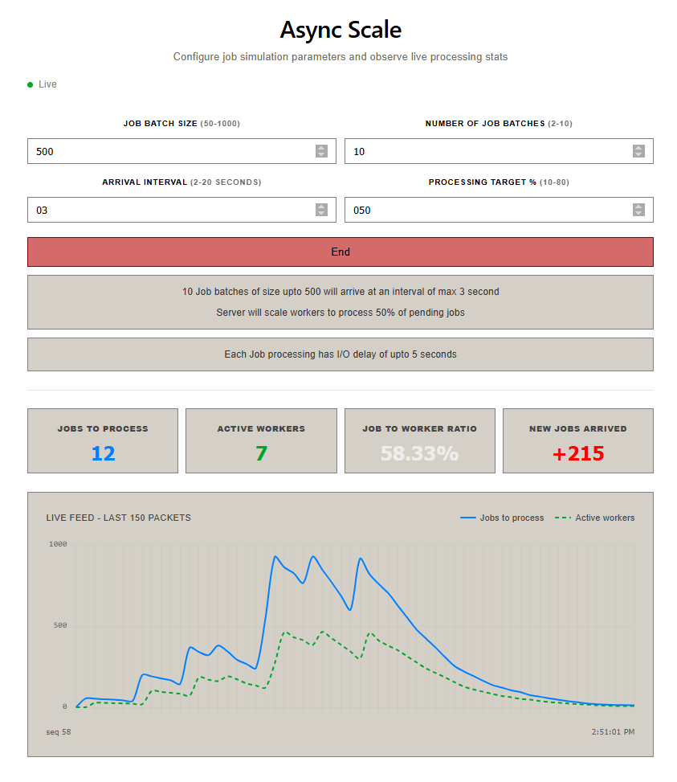

# Async Scale
- Multi-threaded job queue simulation platform that models dynamic worker auto-scaling under varying workloads
- It provides real-time telemetry through WebSockets and an interactive dashboard to visualize queue behavior, worker utilization, and scaling decisions



# Installation

### Prerequisites

- Java 21+
- Maven 3.9+
- Node.js 20+
- npm

### 1. Clone the repository

```bash
git clone https://github.com/mns-one/async-scale-java
cd async-scale
```

### 2. Start the Backend

```bash
cd backend
mvn spring-boot:run
```

The backend will start on:

```
http://localhost:4001
```
### 3. Start the Frontend

On new terminal:

```bash
cd frontend
npm install
npm run dev
```

The frontend will start on:

```
http://localhost:5173
```
### 4. Open the Application

Visit:

```
http://localhost:5173
```

1. Configure the simulation parameters
2. Start the simulation
3. Monitor live telemetry, worker scaling and throughput in real time


# Repo Structure

### Tech Stack

- **Backend:** Java, Spring Boot, Spring WebSocket
- **Frontend:** React, Vite
- **Communication:** REST APIs, WebSockets

## Backend: `backend/src/main/java/com/mns/asyncscale`

#### HTTP handlers
- `controller/SimController.java` — Exposes REST endpoints to start and stop simulations
- `service/SimService.java` — request handling

#### websocket/
- `WebSocketConfig.java` — Configures the WebSocket endpoint
- `TelemetryHandler.java` — Streams live telemetry to connected dashboard clients

#### simulation/
- `RunSim.java` — Entry point to start the core simulation execution
- `StopSim.java` — Handles graceful simulation shutdown
- `Manager.java` — Manages simulation instances for connected clients
- `ClientData.java` — Maintains per client simulation state and metrics
- `State.java` — Defines shared simulation state
- `Scaler.java` — Implements the dynamic worker auto-scaling algorithm
- `Seeder.java` — Generates jobs at configurable intervals
- `Worker.java` — Represents an individual worker processing queued jobs

#### rateLimiter/
- `RateLimiterService.java` — Enforces API request rate limiting
- `Bucket.java` — Token bucket implementation used by the rate limiter

#### dto/
- Request, response, error, and telemetry data transfer objects

#### exception/
- Custom exceptions and global exception handler


## Frontend: `frontend/src/features/job-queue`

- `constants.js` — Shared application constants
- `styles.js` — Centralized styling definitions

#### pages/
- `JobQueueMonitorPage.jsx` — Main dashboard page

#### components/
- `ConfigForm.jsx` — Configuration form for simulation parameters
- `LiveChart.jsx` — Real-time telemetry visualization
- `StatsGrid.jsx` — Displays live simulation metrics
- `MonitorHeader.jsx` — Dashboard header and controls

#### hooks/
- `useJobQueueSession.js` — Manages REST calls, and WebSocket connection
- `useLiveChart.js` — Processes telemetry for chart rendering

#### services/
- `jobQueueApi.js` — API client for backend communication

#### utils/
- `uuid.js` — Client ID generation utility

#### common/
- Reusable UI components
